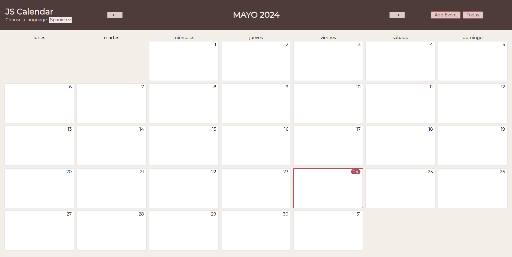

     

&nbsp;

The proposed calendar application is designed to deliver an exceptional user experience through seamless responsiveness and intuitive navigation. It adapts smoothly to various devices, ensuring a consistent and visually appealing interface on smartphones, tablets, and desktops. The app features color-coded event categories to enhance usability. Overall, the app provides a fluid and intuitive platform that makes scheduling and managing events effortless and efficient.

## Used technologies

TS-Calendar has been build using the following technologies.

-Typescript
-HTML
-Tailwind
